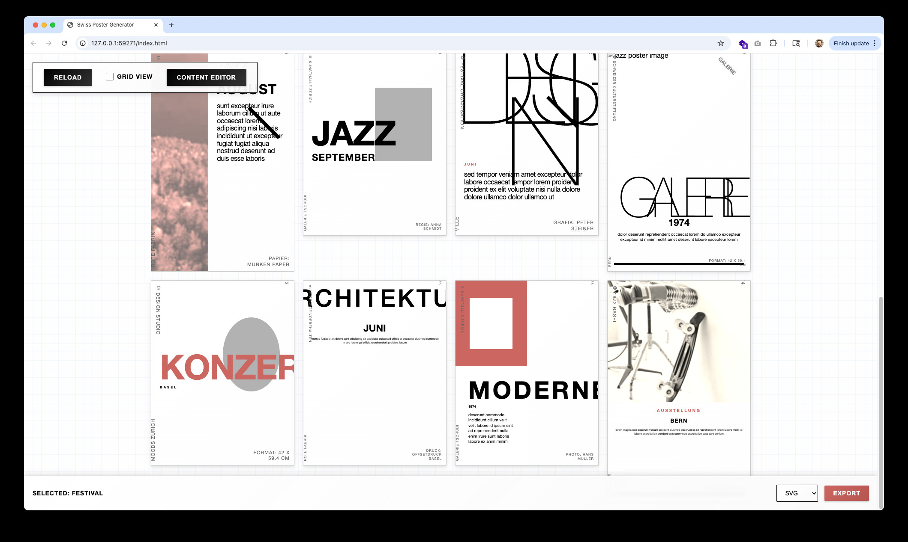
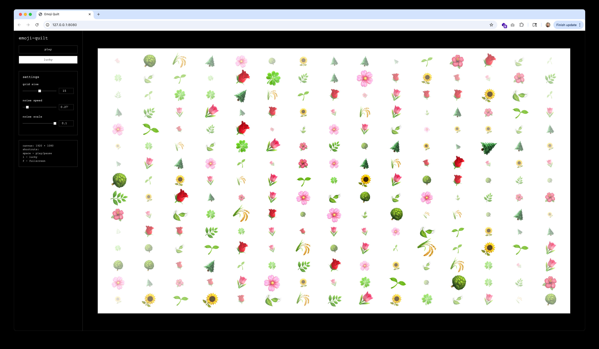
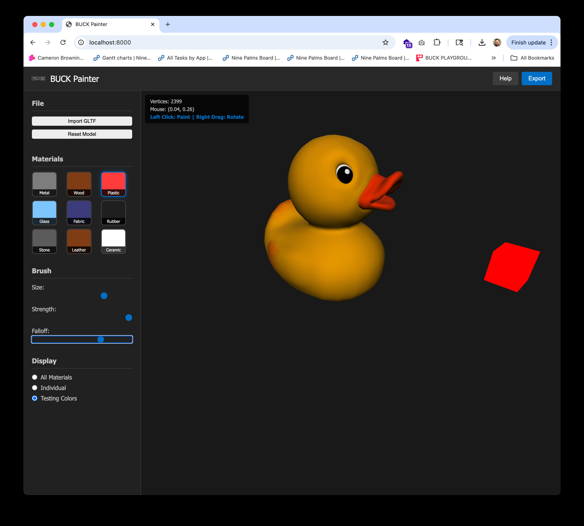
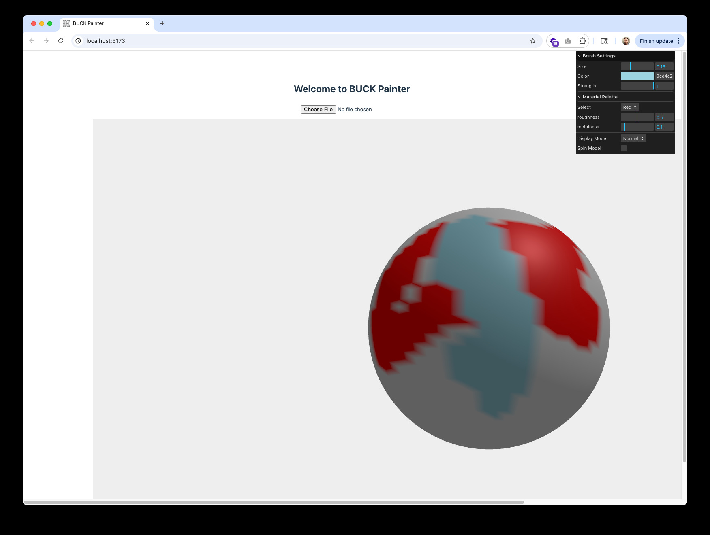

# vibes

I'm [Cameron](https://github.com/camb416) and these are my vibe coded experiments.

As I work on these, I'm developing [vibe coding practices](doc/vibe-coding-practices.md) that inform my approach to this type of software work.

## [Swiss Poster Generator](swiss-poster-generator/index.html)
Last updated: 07/15/2025

- Generates an unlimited number of Swiss poster designs in a browser.
- Fails to export SVG or Figma
- If I really cared about this, I would do it as a Figma plugin
- Doesn't use live AI, just a bunch of procedural rules
- [NOTES](swiss-poster-generator/NOTES.md)
- [REQUIREMENTS](swiss-poster-generator/REQUIREMENTS.md)

## [Type Fractals](type-fractals/index.html)
Last updated: 07/15/2025

- Quick type fractal-type thing with some intelligent defaults for generating patterns
- Looks a little janky, but has a repeatable seed feature that means these could be encoded and reconstituted in any app

## [Emoji Blaster](emoji-blaster/index.html)
Last updated: 07/15/2025

- Particle system that spits emoji around
- meh
- [REQUIREMENTS](emoji-blaster/REQUIREMENTS.md)

## [Emoji Quilt](emoji-quilt/index.html)
Last updated: 07/15/2025

- Noise field with emoji
- the noise function is wack, it's hard to fine-tune
- not as visually interesting as I'd hoped
- [NOTES](emoji-quilt/NOTES.md)
- [REQUIREMENTS](emoji-quilt/REQUIREMENTS.md)

## Buck Painter
Last updated: 07/14/2025

This was an experiment to test the same requirements on three different LLM Coding Agents. I spent maybe 20 minutes on each, and recorded how the LLMs did. Based on the suggestion [here](https://buckdesign.slack.com/archives/C08T3JS851C/p1752516822383259).

### [Buck Painter (Claude Sonnet 4)](buck-painter/claude-sonnet-4/index.html)

#### Notes:
- first attempt looks good, but don't see anything
- after several prompts, i diagnosed that the canvas was rendering 0x0
- it fixed this, and would even import a model, but the paint function didn't work, despite the instructions screen saying left mouse was paint
- i protested, and it made left click "paint", and right click "move", with on screen instructions. This made left click stop moving the camera, but IT DOESN'T PAINT ANYTHING.
- None of the functions in the UI actually do anything. I'm giving up for now.

### [Buck Painter (GPT-4.1)](buck-painter/gpt-41/buck-painter/index.html)

#### Notes:
- GPT 4.1 actually asked me some questions before it started, which made me feel seen.
- It's actually using vite and some tooling. Cool.
- GPT keeps stopping, but it's made a little to-do list for itself. This is really good
- you need to babysit it, but it moves pretty slow and doesn't seem to break things outright nearly as much as Claude
- making changes or improvements to existing features does kind of jump the line and get in the way of the to-dos though

### [Buck Painter (O3)](buck-painter/o3/index.html)

#### Notes:
- it made a "start painting button" I clicked it, nothing happens
- sent the typeerror back to o3
- it also didn't automatically give me the command to run a local http-server, but i know how to do that so whatever.
- do wish these things would think to make a livereload environment
- holy shit it kinda worked
- importing model doesn't work though.

## [Buck Blaster](buck-blaster/index.html)
Last updated: 03/27/2025

- A top-down 2D shooter using BUCK icons. Cursor sorted the icons by color, created the MIDI music, and built the game.
- Took about 8 hours total, at least 4 of which were trying to unbreak some things that the AI broke halfway through after a refactor.

